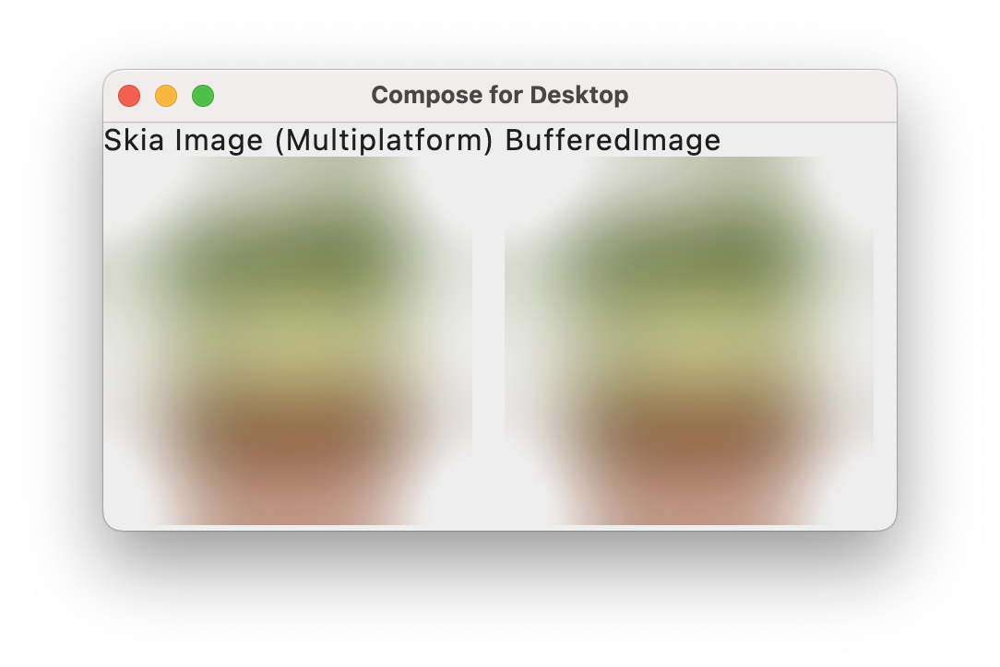

# Kotlin Multiplatform port of [thumbhash](https://github.com/evanw/thumbhash/)

Built on top of Kotlin Multiplatform.

- Common Kotlin algorithm port 
- Automated consistency test between Java and Kotlin 
- Compose Multiplatform implementation 
  - Skia-based graphics abstraction support 
  - `@Composable ThumbhashImage` 

